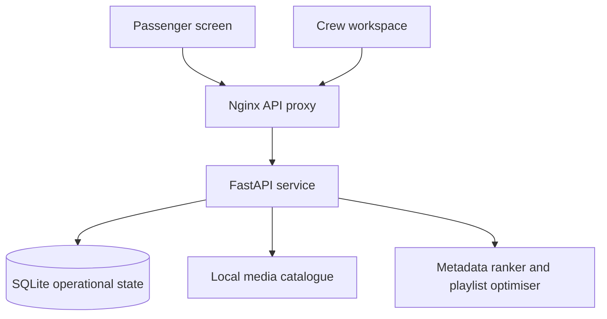

# Architecture

Two React portals use same-origin Nginx proxies to a FastAPI cabin-edge service. SQLite WAL stores flight-scoped operational state. Entertainment assets are local immutable files; playback needs no public internet service.

Aircraft templates expand explicit rows, seat-letter blocks, cabin labels and crew zones. A flight gets a snapshot; subsequent template edits cannot change existing seats. Crew grants and passenger bookings bind identities to active flight instances. Request routing uses the snapshot, never a fixed row-number formula.

Flight inventory is separate from aircraft geometry. Two aircraft can share a layout while carrying different loading manifests. Available units, outstanding reserved units and configured physical capacity are distinct. Supply categories support food, beverages, comfort and equipment. Galley writes and task transitions use `BEGIN IMMEDIATE` and conditional SQL updates; request creation, reservations, idempotency receipts and operational audit entries share one transaction.

Idempotency scope is `(flight, seat, key)`, with a canonical payload hash. Reusing a key for different content returns a conflict. Replay returns the original receipt; current task state is obtained from request history. Cancelling a pending nonurgent task releases its reservation once. Assigned crew own accepted tasks; other crew cannot complete them.

SSE carries flight-scoped invalidation topics without passenger payloads. The browser authenticates the stream with an Authorization header and reloads authoritative state. Reconnection and 15-second polling provide recovery; these are not durable event delivery. Queue and subscriber limits bound memory. Sessions expire after six hours and are revocable. Media uses a separate 15-minute opaque HttpOnly cookie backed by a hashed grant and a live parent session; it grants media GET access only.

Preferences are memory-only on the passenger screen and are not retained server-side. Optional playback positions are scoped to flight and seat. Crew see aggregate recent playback states, not watched titles or preferences. Flight closure and booking replacement clear media history. Service records can contain passenger messages and need an operator retention policy.

Current bounds: one backend process, one SQLite database per cabin-edge deployment, up to 1,000 seats per configured aircraft, 100 stock items per flight, a 500-title local catalogue, a maximum eight-title recommendation shortlist, and a four-title playlist. Crew queries are paginated and the interface shows up to 500 tasks and 200 audit entries. More flights do not turn this into a distributed fleet platform.

Scale-out would require PostgreSQL, a distributed event broker/limiter, airline identity enrollment, media delivery infrastructure and a fleet deployment control plane. No empty adapters or pretend supplier SDK integration are included.
