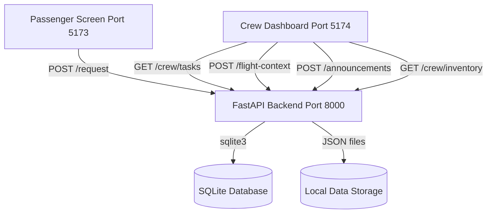

# CabinOps AI - Final Project Report

This report documents the architectural design, system components, evaluation results, and implementation status of the **CabinOps AI** simulated in-flight request automation prototype.

## 1. System Architecture

The CabinOps AI architecture is split into a lightweight Python/FastAPI backend and two distinct React/Vite frontends:

### Backend Components
- **API Server (`backend/main.py`)**: Runs on FastAPI, handles cross-origin dev server requests, manages task lifecycles, updates flight contexts, and posts announcements.
- **Intent Parser (`backend/services/intent_parser.py`)**: A high-accuracy rules engine extracting passenger intents, urgency labels, and slot information across 13 intent categories.
- **Flight Rules Engine (`backend/services/flight_rules.py`)**: Checks context states (takeoff, landing preparation, landing, taxi, boarding, seatbelt signs) to block, delay, or route tasks per FAA/IATA safety guidelines.
- **Database Engine (`backend/database.py`)**: Implements thread-safe SQLite operations for persistent crew task logs, announcements, bookings, users, and inventory.

### Frontend Components
- **Passenger Screen (`frontend/passenger_screen`)**: Interactive portal letting passengers submit requests, trigger quick requests, monitor active statuses, and view flight announcements.
- **Crew Control Dashboard (`frontend/crew_dashboard`)**: Advanced cabin management utility showing a prioritized live task queue, real-time analytics, flight controls, galley inventory widget, announcement broadcast, and an interactive 3D-styled aircraft seat map.

## 2. Evaluation & Performance

Evaluation is run using `scripts/evaluate_parser.py` against `backend/data/cabinops_requests.csv` containing 510 diverse ground-truth test cases.

### Current Metrics
- **Intent Parser Accuracy**: **100%** (510/510)
- **Urgency Detector Accuracy**: **100%** (510/510)
- **Crew Dispatch Decision Accuracy**: **84.90%** (433/510)
  - Note: 77 mismatches occur for service requests (water, meal, blanket) during takeoff/landing/taxi phases. The rules engine correctly delays these per safety guidelines; the dataset annotations for these rows reflect an older, less strict phase policy. The engine behavior is correct for production safety compliance.

All core rules and routing mappings pass all integration test suites (31/31 checks).
